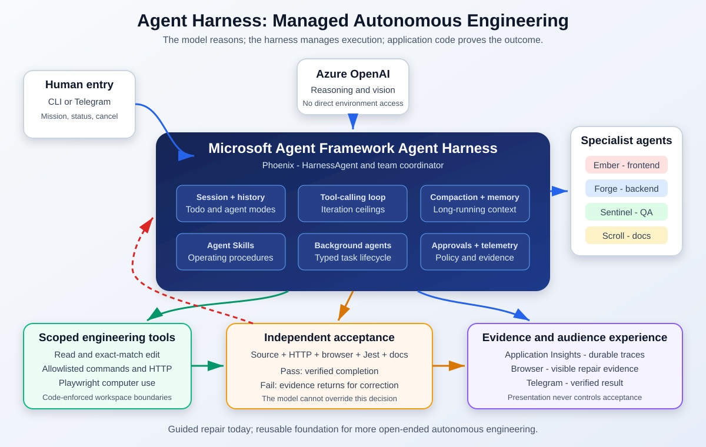

# MAF Agent Harness

A client-ready reference implementation of autonomous code repair using the
**Microsoft Agent Framework Agent Harness**, Azure OpenAI, scoped engineering tools,
Playwright computer use, independent acceptance, OpenTelemetry, and an optional Telegram
trigger.



## What is included

```text
MAF.Agent.Harness/
|-- src/
|   |-- MAF.RPTeam/             Agent Harness mission executable
|   `-- MAF.RPTeam.Telegram/    Optional Telegram trigger
|-- sample-app/
|   |-- frontend/               React repair target
|   `-- backend/                Express repair target
|-- demo-fixtures/buggy/        Five files that reset the guided benchmark
|-- scripts/
|   `-- Reset-SampleToBuggy.ps1
`-- docs/
    |-- Agent.Harness.md         What an Agent Harness is and why it matters
    |-- Computer.Use.md          Computer-use models and their benefits
    |-- Code-Repair-Case-Study.md Applied architecture and lessons
    |-- code-fix.md              Exact repair mechanics and disclosure
    `-- SETUP.md                 Installation and demonstration guide
```

Claw3D and its bridge are intentionally not included. This repository focuses on the Agent
Harness, computer-use repair, verification, telemetry, and the included sample application.

## How the demonstration works

Phoenix is a `HarnessAgent`. It delegates frontend, backend, QA, and documentation work to
four scoped `ChatClientAgent` specialists:

| Agent | Role | Write scope |
|---|---|---|
| Phoenix | Harness-managed coordinator | No file tools |
| Ember | Frontend repair and browser inspection | `sample-app/frontend` |
| Forge | Backend repair and HTTP verification | `sample-app/backend` |
| Sentinel | Regression tests and independent browser inspection | `sample-app/backend` |
| Scroll | Verified documentation | Entire `sample-app` |

The model reasons about source, screenshots, API responses, and test output. The
application independently verifies the exact source fix, live HTTP behavior, browser
rendering, console errors, Jest results, and documentation before it prints:

```text
Mission Complete - independently verified
```

## Important scope disclosure

This is a **guided autonomous repair benchmark**, not blind discovery of arbitrary defects.
The agent skills define the expected work areas and the application defines a deterministic
acceptance contract. The model still performs real diagnosis, tool use, editing, browser
inspection, testing, and corrective work.

The same architecture can support more open-ended repair when paired with repository
discovery, dynamic acceptance, stronger isolation, approval gates, rollback, budgets, and
mandatory human review. See [How the Code Repair Actually Works](docs/code-fix.md).

## Quick start

Prerequisites:

- .NET 8 SDK
- Node.js 18 or later
- Azure OpenAI access
- Azure CLI authentication or another `DefaultAzureCredential` source

From the repository root:

```powershell
dotnet build .\MAF.Agent.Harness.slnx

Set-Location .\sample-app\backend
npm install

Set-Location ..\frontend
npm install

Set-Location ..\..
pwsh .\src\MAF.RPTeam\bin\Debug\net8.0\playwright.ps1 install chromium
```

Configure Azure OpenAI outside source control:

```powershell
dotnet user-secrets set --project .\src\MAF.RPTeam "AzureOpenAI:Endpoint" "https://<resource>.openai.azure.com/"
dotnet user-secrets set --project .\src\MAF.RPTeam "AzureOpenAI:Deployment" "<deployment>"
```

For the complete startup and demo sequence, see [Setup and Demo Guide](docs/SETUP.md).

## Documentation

- [What Is an Agent Harness?](docs/Agent.Harness.md)
- [What Is a Computer-Use Model?](docs/Computer.Use.md)
- [Agent Harness Code-Repair Case Study](docs/Code-Repair-Case-Study.md)
- [How the Code Repair Actually Works](docs/code-fix.md)
- [Setup and Demo Guide](docs/SETUP.md)
