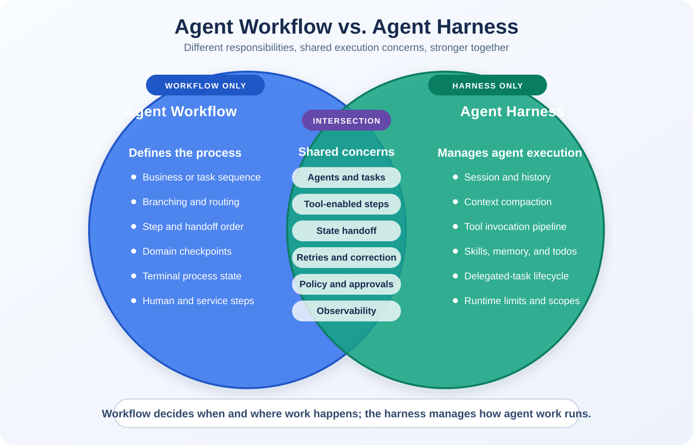

# What Is an Agent Harness?

## Executive summary

An **Agent Harness is the runtime scaffolding that wraps a chat client—the application's
connection to an AI model—and equips it to operate as an agent over long, multi-step
tasks**.

A model can understand a goal, reason about the information available to it, and suggest
the next action. The harness adds the working structure the model needs to keep going:
planning and execution modes, todo tracking, context management, memory, file and tool
access, approval behavior, delegation, limits, and observability.

Instead of every application assembling these pieces independently, it can create a
harness agent and configure the capabilities it needs.

```text
Chat client / model access + Agent Harness scaffolding
                         = an agent equipped to perform managed work
```

The word **scaffolding** is important. A construction scaffold does not design the
building or decide whether the finished building satisfies its owner. It provides the
supporting structure that lets people work safely, repeatedly, and at greater scale.
Likewise, an Agent Harness does not replace model reasoning or domain verification. It
provides the runtime structure that supports the agent while it works.

```text
+------------------------+
| Human goal or incident |
+-----------+------------+
            |
            v
+------------------------+
| AI model               |  Intelligence
| Understand and reason  |
+-----------+------------+
            |
            v
+--------------------------------------------------+
| Agent Harness scaffolding                        |
| Plan/execute | todos | context | memory | tools  |
| approvals | delegation | limits | telemetry      |
+------------------------+-------------------------+
                         |
                         v
+--------------------------------------------------+
| Domain-owned outcome verification               |
| Rules | policy | checks | evidence               |
+------------------------+-------------------------+
                         |
                         v
              Verified result or correction
```

**Microsoft Learn references:** [Create a harness agent](https://learn.microsoft.com/en-us/agent-framework/get-started/harness)
and [Agent Harness concepts and architecture](https://learn.microsoft.com/en-us/agent-framework/concepts/harness)

The important distinction is:

> The model supplies intelligence. The harness supplies the scaffolding for sustained,
> managed execution. Domain-specific verification determines whether the outcome is
> actually correct.

## What the scaffolding provides

An AI model normally produces one response at a time. A real task may require dozens of
model calls, tool operations, delegated tasks, validation checks, and correction rounds.
The harness provides reusable scaffolding for maintaining that work across time.

| Scaffolding component | What it enables |
|---|---|
| **Planning and execution modes** | Separates deciding what to do from carrying out the work |
| **Todo tracking** | Keeps a visible, durable representation of remaining work |
| **Context compaction** | Preserves important information without allowing history to grow without bound |
| **File memory** | Carries useful working knowledge beyond one model response |
| **File and tool access** | Allows the agent to act through application-approved capabilities |
| **Tool approvals** | Applies human or policy authorization before selected actions |
| **Background agents** | Delegates specialized or parallel work and tracks its lifecycle |
| **Bounded looping** | Lets the agent continue multi-step work within explicit limits |
| **Observability** | Records model, tool, delegation, timing, and failure activity |
| **Session persistence** | Maintains the agent's state across multiple interactions |

Without this scaffolding, the team building an agentic application must assemble and
integrate these runtime concerns itself. The harness makes them available as a coherent
agent runtime that can be configured rather than rebuilt for every solution.

**Microsoft Learn reference:** [Create a harness agent](https://learn.microsoft.com/en-us/agent-framework/get-started/harness)

## Agent workflow versus Agent Harness

An **agent workflow** and an **Agent Harness** solve different problems. They are usually
complementary rather than competing approaches.

- An **agent workflow** defines the task logic: which steps, agents, decisions, and
  handoffs occur, and in what order.
- An **Agent Harness** provides the managed execution environment in which an agent can
  perform that work over time.

In short:

> A workflow describes **what work should happen and how it is coordinated**.
> A harness provides **the runtime capabilities, controls, and lifecycle for executing
> agent work reliably**.

### Venn diagram: what belongs to each and what intersects



**Microsoft Learn references:** [Workflow concepts](https://learn.microsoft.com/en-us/agent-framework/concepts/workflows/)
and [Agent Harness](https://learn.microsoft.com/en-us/agent-framework/concepts/harness)

| Workflow only | Intersection: both participate | Harness only |
|---|---|---|
| Defines the business or task sequence | Agents perform tasks within a coordinated process | Preserves the agent's conversation and session history |
| Chooses branches, routes, and handoff order | Tools may be used by workflow steps or harness-managed agents | Compacts long context across model interactions |
| Defines which step follows success, failure, or approval | State and results move between tasks and agents | Runs the model/tool invocation pipeline |
| Establishes domain checkpoints and terminal workflow states | Failures can trigger retries or correction paths | Loads reusable skills, memory, todos, and modes |
| Coordinates non-agent steps, services, people, and agents | Policy, approvals, and telemetry can span both layers | Manages delegated-agent task IDs, status, and lifecycle |
| Expresses process-level service-level objectives | Both contribute evidence used by domain verification | Applies reusable runtime limits, scopes, and middleware |

The intersection does not mean both layers implement the same feature in the same way. For
example, a workflow may decide **when** approval is required, while the harness enforces
approval middleware around the agent's tool call. A workflow may decide **when** to
delegate, while the harness manages the delegated agent's execution and status.

| Dimension | Agent workflow | Agent Harness |
|---|---|---|
| **Primary purpose** | Orchestrate a business or task process | Operate an agent safely and consistently |
| **Main question** | “What happens next?” | “How does this agent execute, persist, use tools, and remain controlled?” |
| **Typical structure** | Sequence, graph, router, handoff, branch, loop, or approval step | Runtime pipeline around model calls, tools, state, policy, and telemetry |
| **Control style** | Often application-defined and explicit | Provides reusable managed capabilities to the agent |
| **State** | Workflow state usually tracks steps and outputs | Session state can include conversation history, memory, todos, modes, and delegated tasks |
| **Tools** | A workflow may call tools directly or ask agents to call them | The harness manages tool exposure, invocation, approval, and execution loops |
| **Delegation** | Defines when work moves to another agent or step | Supplies the mechanisms and lifecycle for running and tracking delegated agents |
| **Context** | Passes selected data between workflow steps | Preserves and compacts an agent's evolving context across many interactions |
| **Limits and policy** | Must be designed into each workflow or surrounding application | Can provide standard iteration limits, approvals, scopes, and execution policy |
| **Observability** | Tracks workflow steps and transitions | Tracks model calls, tool calls, sessions, delegation, and runtime behavior |
| **Completion** | Reaches the workflow's terminal step | Reaches a managed agent or task state; domain verification must still confirm the outcome |
| **Best fit** | Repeatable processes with known stages and routing | Long-running, tool-using, stateful, or delegated agent execution |

### Example

A customer-support workflow might define:

```text
Receive request -> classify issue -> retrieve account context
                -> draft resolution -> request approval -> respond
```

**Microsoft Learn reference:** [Workflow concepts](https://learn.microsoft.com/en-us/agent-framework/concepts/workflows/)

The Agent Harness can support the agent within those steps by preserving its session,
providing approved retrieval and communication tools, loading support skills, tracking
delegated research, enforcing limits, and recording telemetry.

In this repository's software-repair example, the workflow is approximately:

```text
Inspect problem -> delegate frontend and backend work
                -> add regression coverage -> update documentation
                -> run independent acceptance -> correct or complete
```

**Microsoft Learn references:** [Workflow concepts](https://learn.microsoft.com/en-us/agent-framework/concepts/workflows/)
and [Agent Harness](https://learn.microsoft.com/en-us/agent-framework/concepts/harness)

The harness does not replace that sequence. It gives Phoenix the state, skills, tools,
delegation, bounded loops, approvals, memory, and telemetry needed to execute its part of
the sequence.

### When a workflow may be enough

A simple, deterministic process may only need a workflow. For example, an application that
always retrieves one record, applies a fixed transformation, and sends the result may not
need a long-lived agent runtime.

### When a harness becomes valuable

A harness becomes more valuable when an agent must:

- reason and act across many model turns;
- retain or compact evolving context;
- choose among multiple tools;
- delegate and monitor parallel work;
- recover from incomplete results;
- follow reusable skills and approval policy;
- operate within hard limits; or
- provide detailed runtime telemetry.

Many production systems use both: the workflow provides predictable business
orchestration, while the harness provides dependable agent execution inside one or more
workflow steps.

## Example: what the harness does in this repository

The concepts above are domain-neutral. This repository applies them to one specific
example: autonomous software repair.

Phoenix is the coordinator and is created as a Microsoft Agent Framework
`HarnessAgent`:

```csharp
var phoenix = chatClient.AsHarnessAgent(phoenixOptions);
```

**Microsoft Learn references:** [Create a harness agent with `AsHarnessAgent`](https://learn.microsoft.com/en-us/agent-framework/get-started/harness)
and [Agent Harness concepts and architecture](https://learn.microsoft.com/en-us/agent-framework/concepts/harness)

The harness gives Phoenix the scaffolding used by this example:

- a durable session across the repair mission;
- function invocation and a bounded model/tool loop;
- todo state and reusable skills;
- long-context compaction and file memory;
- approval middleware;
- OpenTelemetry instrumentation; and
- typed background-agent tools.

Phoenix delegates to four specialists:

| Agent | Responsibility | Boundary |
|---|---|---|
| Ember | Frontend diagnosis, repair, and browser inspection | Frontend files |
| Forge | Backend diagnosis, repair, and HTTP checks | Backend files |
| Sentinel | Regression tests and independent browser inspection | Test-related scope |
| Scroll | Verified operational documentation | Documentation scope |

Phoenix coordinates the work but does not receive unrestricted file-editing tools. This
separation makes the mission easier to understand, constrain, and audit.

## What the harness does not do

The harness is not:

- the AI model;
- a substitute for domain validation, such as tests, policy checks, or human review;
- a guarantee that the generated result is correct;
- the business definition of success;
- permission to access every file or system; or
- a replacement for human accountability.

Every implementation still needs a domain-specific way to verify outcomes. For example, a
customer-service workflow might verify policy compliance and case resolution, while a
document-processing workflow might verify required fields and approval status.

In this repository's software-repair example, the application keeps the final acceptance
contract outside the harness. It independently checks source code, HTTP responses, Jest
results, browser rendering, browser errors, screenshots, and documentation.

A specialist task reaching `completed` means the specialist finished its assigned work.
It does **not** necessarily mean the real-world outcome is correct. In this example, only
the software acceptance gate can decide that the application is fixed.

## Business benefits

### Repeatability

Skills, tool definitions, boundaries, and completion rules are configured once and applied
consistently across missions.

### Safer autonomy

Agents receive only the capabilities needed for their roles. Approval rules and hard
limits reduce the risk of uncontrolled actions.

### Better use of specialists

One coordinator can delegate work to agents with focused responsibilities instead of
forcing one model conversation to hold every concern.

### Operational visibility

Model calls, tool calls, delegation, duration, failures, and acceptance rounds can be
correlated under one mission trace.

### Clearer completion

The system separates an agent's claim from verifiable evidence. Failed acceptance can
return precise evidence for a bounded correction round.

### Reusable automation platform

The same harness pattern can support many controlled workflows. Examples include customer
service, document processing, research, compliance review, incident investigation,
operations, code repair, test generation, and documentation maintenance.

## Agent framework, agent, and harness

These terms are related but not interchangeable:

| Term | Meaning |
|---|---|
| **Model** | Produces reasoning and language or multimodal responses |
| **Agent** | A model configured with instructions, identity, and tools |
| **Agent framework** | APIs and abstractions used to build agents and workflows |
| **Agent workflow** | Application-defined orchestration of steps, decisions, agents, handoffs, and outcomes |
| **Agent Harness** | The runtime scaffolding around a model or agent: planning, state, context, memory, tools, skills, delegation, policy, limits, and telemetry |
| **Outcome verification** | Domain-specific proof that the agent's result satisfies the real requirement |

## Practical design principle

Reliable autonomous systems require all three layers:

```text
Model intelligence
        +
Harness-managed execution
        +
Domain-owned verification
```

**Microsoft Learn references:** [Microsoft Agent Framework overview](https://learn.microsoft.com/en-us/agent-framework/overview/)
and [Agent concepts](https://learn.microsoft.com/en-us/agent-framework/concepts/agents/)

Removing any one of these layers weakens the system. Reasoning without execution cannot
perform the work. Execution without governance is difficult to trust. Governance without
independent verification can still accept the wrong outcome.

## Related documents

- [Agent Harness Code-Repair Case Study](Code-Repair-Case-Study.md)
- [What Is a Computer-Use Model?](Computer.Use.md)
- [How the Code Repair Actually Works](code-fix.md)
- [Setup and Demo Guide](SETUP.md)
